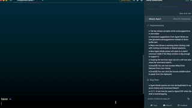

# GMU Daily Permit Automation

**`gmu` is a Python command-line to speed up purchase of a
Daily (Parking) Permit from [GMU](https://gmu.t2hosted.com/per/selectpermit.aspx).**

[](https://youtu.be/9X5lc2zZq-k)

Use it to purchase following supported Permit:
* `Evening General Permit (only valid from 4:00pm-11:59pm)`

> [!IMPORTANT]
> 2FA [with Duo](https://duo.com/) is still necessary. 
> Please keep your phone handy when running the Script.

## Quickstart

> [!CAUTION]
> Remember to double check and set [parking date](#parking-date) each script run!

1. Download [Python](https://www.python.org/downloads/) if needed.
2. Install this project with `pip`. Requires Python 3.8+.
    ```sh
    pip install git+https://github.com/rnag/GMU-Daily-Permit-Automation.git
    ```
3. Run `gmu c` to get set up.
4. Confirm config with `gmu sc`.
5. Run the Script and watch the magic happen.

   ```shell
   gmu dp
   ```

## Motivation (or Rationale)

As a current, part-time graduate student @ [George Mason](https://www.gmu.edu/), I usually take 1 class per semester,
and it's more cost-effective to purchase the Daily Permit, as opposed to a Weekly or Semester Permit.

However, purchasing a Daily Permit is a time-consuming process, and I usually procrastinate and leave it off till
the last minute (day of) which results in added stress on my part.

This Script aims to solve my longstanding issue, and enable me to more easily
purchase Daily Permit for the date of class.

## Fields

### Parking Date

You can pass either a *weekday* or a *hardcoded date* for the `parking date` -- date a purchased daily parking permit is valid for.

#### Weekday

Parking Date can be a weekday like `'Monday' 'Tuesday' 'Wednesday'` and so on.

In this case, the script will calculate and use the date of the upcoming weekday, starting from today.

If *weekday* falls on today -- for example, if parking date is "Monday" and today is
a Monday -- then today's date will be used.

#### Hard-coded Date

You could also hard-code the date: `October 10`

It will need to be [in the format](https://docs.python.org/3/library/datetime.html#strftime-and-strptime-format-codes) of `%B %d`, as above. 

_Example:_ `December 31`

## Getting Help

To get help on the CLI tool, type `gmu` in a terminal window
after the install step:

```console
$ gmu

 Usage: gmu [OPTIONS] COMMAND [ARGS]...

╭─ Options ──────────────────────────────────────────────────────────────────────────╮
│ --install-completion            Install completion for the current shell.          │
│ --show-completion               Show completion for the current shell, to copy it  │
│                                 or customize the installation.                     │
│ --help                -h        Show this message and exit.                        │
╰────────────────────────────────────────────────────────────────────────────────────╯
╭─ Commands ─────────────────────────────────────────────────────────────────────────╮
│ c | configure       Prompts the user for configuration values and updates the TOML │
│                     file.                                                          │
│ dp | daily-permit   Purchase a Daily (Parking) Permit for the GMU Campus.          │
│ sc | show-config    Show the config file.                                          │
╰────────────────────────────────────────────────────────────────────────────────────╯
```

To get help on a subcommand, pass in the `-h | --help` option.

For example:
```
$ gmu dp -h

 Usage: gmu dp [OPTIONS]

 Purchase a Daily (Parking) Permit for the GMU Campus.

╭─ Options ──────────────────────────────────────────────────────────────────────────╮
│ --dry-run  -d        Enable dry run (do not purchase permit).                      │
│ --yes      -y        Skip prompts for user input and confirmation.                 │
│ --help     -h        Show this message and exit.                                   │
╰────────────────────────────────────────────────────────────────────────────────────╯
```
